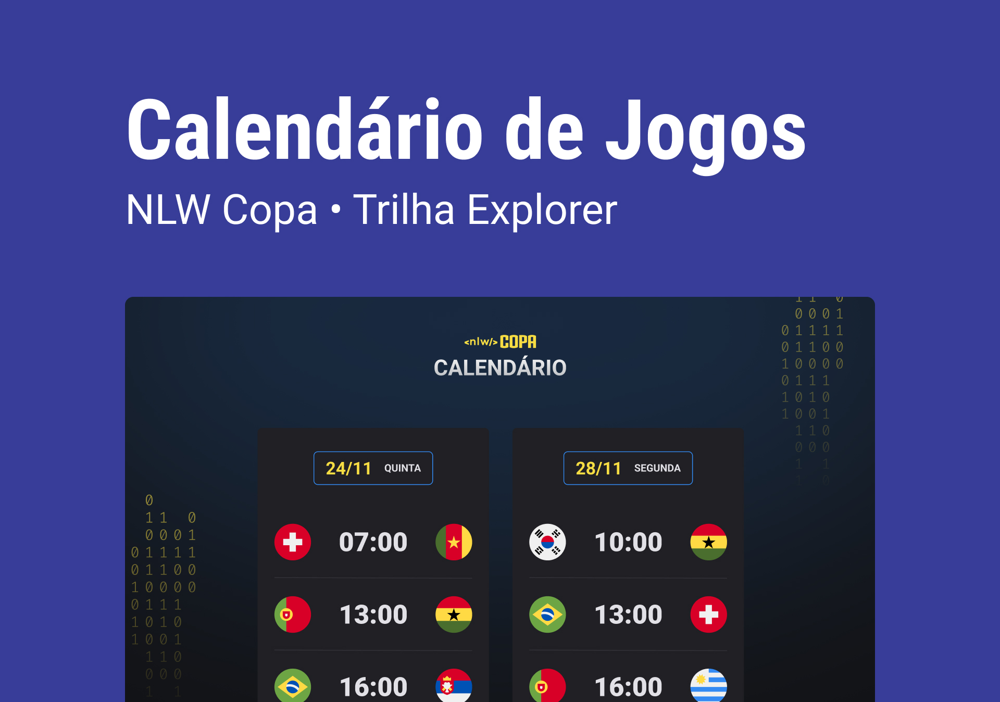

<h1 align="center"> NLW #10 Copa </h1>

Evento esclusivo gratuito, promosso dalla Rocketseat per insegnamento di tecnologia WEB.

  <a href="#-tecnologias">Tecnologia</a>&nbsp;&nbsp;&nbsp;|&nbsp;&nbsp;&nbsp;
  <a href="#-projeto">Proggetto</a>&nbsp;&nbsp;&nbsp;|&nbsp;&nbsp;&nbsp;
  <a href="#-layout">Layout</a>&nbsp;&nbsp;&nbsp;|&nbsp;&nbsp;&nbsp;
  <a href="#memo-licença">Licença</a>

  

 

  

## 🚀 Tecnologias

Questo proggetto è stato fatto usando le tecnologie seguenti:

- HTML e CSS
- JavaScript
- Git e Github

## 💻 Projeto

Il Calendario della Copa è un proggetto che mostra le partite della coppa 2022

## 🔖 Layout

 Puoi visualizzare il layout del proggetto attraverso il link:[DESSE LINK](https://www.figma.com/file/J1Z33MISC22YZB8wfxiIns/NLW-Copa-Explorer/duplicate). É necessario avere un account [Figma](https://figma.com) per accedere

## :memo: Licença

Questo proggetto è sotto licenza MIT.

---

Feito com ♥ by Rocketseat :wave: [Participe da nossa comunidade!](https://discord.gg/rocketseat)